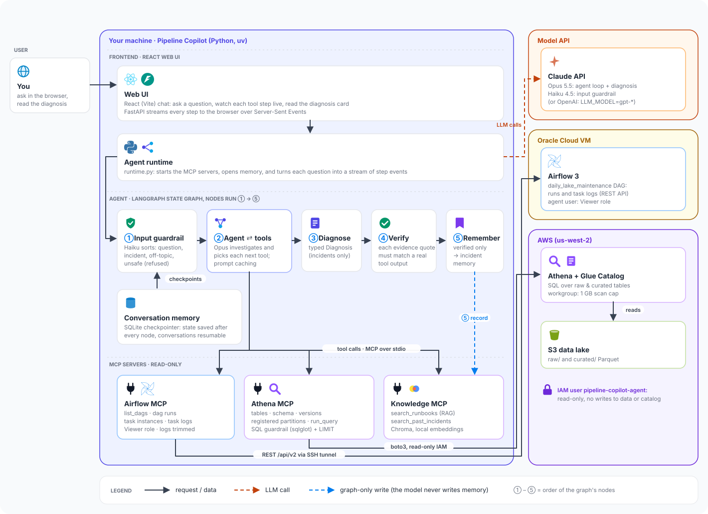

# Pipeline Copilot

**An AI on-call assistant for data pipelines.** Ask it why something looks wrong and it investigates the way an on-call engineer would: it reads Airflow runs and logs, queries the data lake, checks the team's runbooks and past incidents, then returns a structured diagnosis in which **every piece of evidence is verified against real tool output**.

Built with **LangGraph** (agent loop), **MCP** (three tool servers), **RAG** (runbooks in Chroma), **layered guardrails** and **persistent memory**, on Claude Opus 5.5 with a Claude Haiku 4.5 input guardrail.

It runs against my own [weather-seismic-pipeline](https://github.com/mahendramahato/weather-seismic-pipeline) (NOAA + USGS → Kafka → Spark → S3 → Glue → Athena, orchestrated by Airflow), but nothing in the design is specific to it.

---

## It found a real bug in my pipeline

While I was building it, the agent found a **silent failure** in the live pipeline:

- Every Airflow run was **green**, and the Glue curation job reported **SUCCEEDED** every night.
- But the curated tables had **stopped updating 4 days earlier**. By the time it was fixed, about 4,200 weather readings and 1,700 raw earthquake rows were sitting uncurated.

What happened: I had deleted a Glue crawler that I thought was no longer needed. Athena kept seeing new data through *partition projection*, but the Glue Spark job reads through the Glue catalog, which **ignores projection**. So the job read 0 rows each night and "succeeded".

| Stage | What the agent did |
|---|---|
| Without RAG | Detected the silent failure and its exact impact, but blamed the wrong side. It even fetched the decisive evidence (catalog partitions stopping at 09-30) and explained it away |
| With a runbook (RAG) | Correct root cause, with evidence from both raw tables, and cited the runbook. It also noted that "a change around 09-30 stopped partition registration", which turned out to be exactly the crawler deletion |
| Fixed | The Glue job now reads S3 paths directly and **fails loudly** on empty input; 10-01 to 10-06 backfilled |

Full write-up, including the honest caveat that the runbook was written after the cause was known: [docs/evals.md](docs/evals.md).

---

## What an answer looks like

```
you> Why is the curated data stuck at 2026-09-30?
  → search_past_incidents(query='curated data stuck not advancing')
  → search_runbooks(query='curated data missing likely causes how to check', k=4)
  → get_registered_partitions(table='raw_weather')
  → get_table_schema(table='raw_weather')
  → run_query(sql="SELECT r.date, r.raw_rows, COALESCE(c.cur_rows,0) ...")
  ... (15 tool calls)

  ┌─ DIAGNOSIS ──────────────────────────────────────────────────
  │ category=silent_data_gap  confidence=high
  │ root cause: raw tables use Athena partition projection, but the Glue job reads
  │   via the catalog, where partitions stop at 2026-09-30 ...
  │ ✓ [get_registered_partitions]: "raw_weather: 4 registered partitions (2026-09-27 to 2026-09-30)"
  │ ✓ [get_table_schema]: "'projection.date.range': '2026-09-27,NOW'"
  │ ✓ [run_query]: "2026-10-02 | 808 | 0"
  │ ✓ [get_task_log]: "AWS Glue Job: curate-daily status: SUCCEEDED. Run Id: jr_58c9..."
  │ grounding: 9/9 quotes verified
  │ runbooks: runbook_curated_data_missing.md, runbook_backfill.md
  │ unverified: Glue CloudWatch log ("0 raw -> 0 curated") not accessible
  │ memory: incident memory: 2026-10-06:silent_data_gap
  └──────────────────────────────────────────────────────────────
```

Each ✓ means code found that exact text in that tool's output. The `unverified` list separates what the agent observed from what it couldn't check.

---

## Architecture



**The frontend** is a React web UI: you ask there, and every step streams back live.
**The agent** is a LangGraph state graph: a cheap guardrail first, then an investigation loop,
then (for incidents only) a typed diagnosis whose evidence is checked by code before it is
shown or remembered. **MCP servers** are the only way out to Airflow, Athena and the runbooks,
and each one runs with read-only credentials. **The knowledge base** is the RAG half: the team's runbooks
are split by section and embedded into Chroma offline (whenever the docs change), and the
agent searches them during an investigation. The same store keeps verified past incidents.

- **The agent decides, the servers do.** Each MCP server owns its own credentials; the agent process never holds the Airflow password or AWS keys. The same servers also work from Claude Code (`.mcp.json`).
- **Diagnosis is a separate, typed step.** The agent investigates freely, then a focused call extracts a Pydantic `Diagnosis` (category, root cause, evidence quotes, impact, fix, runbooks used, what's unverified, confidence).

## Guardrails: defense in depth

| Layer | Stops | Enforced by |
|---|---|---|
| Input guardrail | Off-topic requests, prompt injection, requests for secrets or destruction | Claude Haiku classifier, fixed refusal text, fails closed |
| Read-only credentials | Any change to Airflow or AWS | Airflow Viewer role; IAM policy with no write access to data ([infra/iam](infra/iam/pipeline-copilot-readonly.json)) |
| SQL guardrail | `DROP`, stacked statements, `WITH ... INSERT`, other databases, unknown tables, huge results | `sqlglot` parse-tree checks, forced `LIMIT` ([21 tests](tests/test_sql_guard.py)) |
| Cost limits | Runaway queries | Athena workgroup 1 GB scan cap, row and log-size caps, recursion limit |
| Output guardrail | Made-up evidence | Every evidence quote must appear verbatim in a real tool output, or confidence is lowered ([10 tests](tests/test_output_guardrail.py)) |
| Memory hygiene | Poisoned memory | Only verified diagnoses are saved, by the graph; the model can't write memory |

---

## Evaluation

Seven failures injected into a **simulated** pipeline: fake tools with the real tool schemas, the real SQL guardrail, real SQL in DuckDB and a fixed clock. They run through the real agent graph and are scored by code (category, required facts, no red herrings, grounding). Four scenarios deliberately have **no runbook**.

| Scenario | Expected | Result | Confidence |
|---|---|---|---|
| Upstream field rename (magnitude NULL) | schema_drift | ✓ | medium |
| One station's sensor failing (no runbook) | bad_upstream_data | ✓ | medium |
| S3 timeout, retry succeeded (no runbook) | transient_failure | ✓ | high |
| Replayed rows in raw (no runbook) | duplicates | ✓ | high |
| Bad Glue deploy (`temp_c` column) | code_bug | ✓ | high |
| Task running 3.5h vs a 10-minute limit (no runbook) | stuck_task | ✓ | high |
| Nothing wrong (false-alarm check) | no_problem_found | ✓ | high |

**7/7 correct, 7/7 grounded, 0 confidently wrong, about $0.09 per investigation** (agent loop, with prompt caching; $0.21 before caching).

Caveats: a single run per scenario, scenarios written by the agent's author, and keyword-based scoring. The suite also shows the main weakness: **healthy or "nothing to do" cases still take 17–18 tool calls**, so the agent over-investigates.

---

## Tech stack

| | |
|---|---|
| Agent | LangGraph, Claude Opus 5.5 (agent + diagnosis), Claude Haiku 4.5 (guardrail), prompt caching. Provider is switchable: set `LLM_MODEL` to a `gpt-*` model to run on OpenAI |
| Tools | MCP Python SDK (FastMCP), `langchain-mcp-adapters`, stdio transport |
| Data access | Airflow 3 REST API (`httpx`), Athena + Glue (`boto3`), `sqlglot` |
| RAG + memory | Chroma (local embeddings), LangGraph SQLite checkpointer |
| Interfaces | Terminal chat; FastAPI with Server-Sent Events + React (Vite) |
| Testing | pytest (43 tests), a simulated eval suite with DuckDB, LangSmith tracing |
| Tooling | Python 3.12, `uv` |

## Repository layout

```
src/pipeline_copilot/
  graph.py, graph_state.py   LangGraph wiring and state
  guardrails.py              input guardrail (Haiku)
  output_guardrail.py        evidence grounding check
  sql_guard.py               SQL guardrail
  models.py                  Diagnosis / Evidence
  knowledge_base.py          chunking, Chroma index, incident memory
  airflow_client.py, athena_client.py
  mcp_servers/               airflow_server, athena_server, knowledge_server
  runtime.py                 starts MCP servers + memory; one question → stream of events
  cli.py                     terminal chat
  api.py                     FastAPI: SSE chat stream, saved conversations, serves the UI
frontend/                    React (Vite) UI: live tool steps, diagnosis card with ✓/✗ evidence
knowledge/                   pipeline overview + runbooks (the RAG source)
evals/                       simulated world, fake tools, scenarios, runner
tests/                       SQL guard, retrieval, grounding tests
infra/iam/                   read-only IAM policy
docs/                        recon notes, eval log
```

---

## Running it

**Prerequisites:** Python 3.12+ and [uv](https://docs.astral.sh/uv/); an Anthropic API key; for live use, read-only access to an Airflow 3 instance and to Athena (see [docs/recon.md](docs/recon.md)). The tests and evals need **no** Airflow or AWS access.

```bash
uv sync
cp .env.example .env                              # fill in keys and passwords
uv run python -m pipeline_copilot.knowledge_base  # build the runbook index
```

```bash
# Chat (Airflow reached through an SSH tunnel)
ssh -N -o ServerAliveInterval=30 -L 8080:localhost:8081 ubuntu@<vm-ip>
uv run pipeline-copilot                           # new conversation
uv run pipeline-copilot --thread <id>             # resume one

# Web UI: FastAPI serves the built React app and the API on http://127.0.0.1:8000
(cd frontend && npm install && npm run build)
uv run pipeline-copilot-api
# UI development with hot reload: run the API as above, then
(cd frontend && npm run dev)                      # http://localhost:5173, proxies /api

# Tests (no network needed)
uv run pytest

# Eval suite (~$0.60 on Opus with caching)
uv run python -m evals.run
LLM_MODEL=gpt-6.1-sol uv run python -m evals.run   # same suite on another model
uv run python -m evals.run --only stuck_task --repeat 3
```

### Hosting

The hosted version runs on the same Oracle VM as the pipeline, as one Docker container
(React build + API + agent + MCP servers) on the pipeline's Docker network, behind the
pipeline's Caddy on its own HTTPS subdomain.

- **Public:** a showcase of real, reviewed investigations (`showcase/*.json`), replayed with
  the full timeline and diagnosis. Visitors never touch the live agent or its memory.
- **Owner only:** live questions and saved conversations, behind a password (signed HttpOnly
  cookie, login rate limits). The API refuses to listen publicly without a password set.
- Export a conversation to the showcase:
  `uv run python -m pipeline_copilot.showcase export <thread_id> <slug> "<title>"`

```bash
cp .env.deploy.example .env.deploy        # fill in keys and passwords
docker compose up -d --build
```

---

## Limitations and future work

- **Read-only by design:** it diagnoses and suggests fixes; a human applies them.
- It can't see container logs or Glue CloudWatch logs, so failures inside a stream job or Glue script are visible only through their effects.
- Over-investigation on simple cases (see Evaluation).
- The web API has no login, so it binds to localhost only.
- **Next:** auto-triggering from Airflow failure callbacks, and human-approved remediation (LangGraph `interrupt()`).
